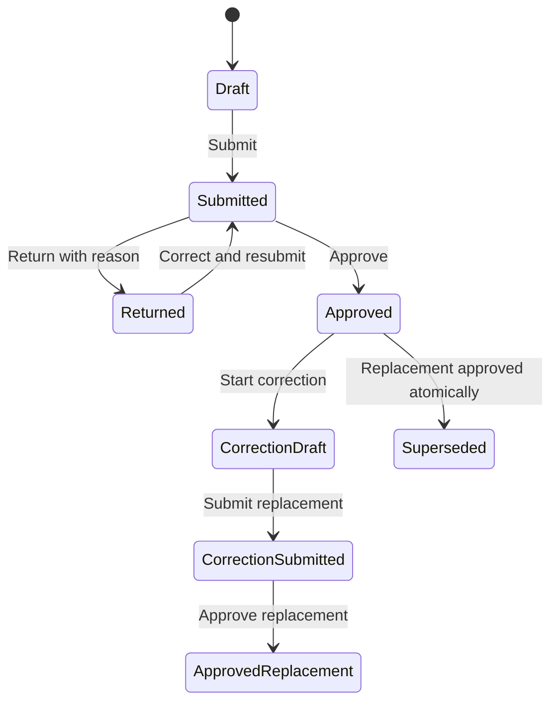

# Daily Report API — V1 vertical slice

این API مسیر رسمی «ثبت واقعیت → ارسال → بازبینی» را پیاده می‌کند. ثبت Fact به WBS، Budget Baseline یا فعال‌بودن HSE وابسته نیست.

## Endpointها

| Method | Path | Permission | نتیجه |
| --- | --- | --- | --- |
| `GET` | `/api/v1/projects/{projectId}/daily-reports` | `field.daily-reports.read` | فهرست ۶۰ گزارش اخیر |
| `GET` | `/api/v1/projects/{projectId}/daily-reports/inbox` | `field.daily-reports.review` | گزارش‌های Submitted در انتظار تصمیم |
| `GET` | `/api/v1/projects/{projectId}/daily-reports/{reportId}` | `field.daily-reports.read` | گزارش با Factها |
| `POST` | `/api/v1/projects/{projectId}/daily-reports` | `field.daily-reports.capture` | ساخت Draft |
| `POST` | `/api/v1/projects/{projectId}/daily-reports/{reportId}/facts` | `field.daily-reports.capture` | افزودن Fact ساختاریافته |
| `POST` | `/api/v1/projects/{projectId}/daily-reports/{reportId}/submit` | `field.daily-reports.submit` | ارسال برای بازبینی |
| `POST` | `/api/v1/projects/{projectId}/daily-reports/{reportId}/return` | `field.daily-reports.review` | عودت با دلیل الزامی |
| `POST` | `/api/v1/projects/{projectId}/daily-reports/{reportId}/approve` | `field.daily-reports.review` | تأیید گزارش |
| `POST` | `/api/v1/projects/{projectId}/daily-reports/{reportId}/corrections` | `field.daily-reports.review` | ایجاد Draft اصلاحی با دلیل و کپی ردیابی‌شده Factها |
| `POST` | `/api/v1/projects/{projectId}/daily-reports/{reportId}/details` | مالک دارای Capture یا Reviewer | اصلاح metadata نسخه Draft/Returned |
| `POST` | `/api/v1/projects/{projectId}/daily-reports/{reportId}/facts/{factId}/remove` | مالک دارای Capture یا Reviewer | حذف Fact فقط از نسخه Draft/Returned |

همه POSTها به `Idempotency-Key` نیاز دارند. Headerهای Development در `development-identity.md` مستند شده‌اند و جای Authentication تولیدی نیستند.

همه Mutationهای این مسیر فقط برای پروژه `Active` پذیرفته می‌شوند. هر Fact جدید باید `locationId` یک Location فعال از همان Tenant/Project داشته باشد؛ نام آزاد ارسال‌شده مرجع نیست و سرور نام رسمی Location را Snapshot می‌کند. `locationId = null` فقط در سابقه‌های قدیمی پیش از مهاجرت قابل مشاهده است.

## Workflow

- Fact فقط در `Draft` یا `Returned` قابل افزودن است.
- Submit حداقل یک Fact و `baseRevision` برابر نسخه سرور می‌خواهد.
- Return فقط از `Submitted` و با دلیل انجام می‌شود.
- Approve فقط از `Submitted` انجام می‌شود.
- هر تغییر Aggregate، Audit، Outbox و Idempotency Receipt را در یک transaction PostgreSQL می‌نویسد.
- گزارش Approved درجا ویرایش نمی‌شود. Correction دارای `rootReportId`، `versionNumber`، `supersedesReportId`، دلیل و آغازکننده است.
- Factهای کپی‌شده شناسه تازه و `copiedFromFactId` دارند؛ حذف آن‌ها به نسخه قبلی آسیب نمی‌زند.
- نسخه قبلی تا زمان Approval نسخه جایگزین همچنان Approved و منبع رسمی است. Approval جایگزین و Supersede قبلی در یک transaction انجام می‌شوند.
- API زنجیره دوطرفه `supersedesReportId/supersededByReportId`، زمان Supersede و تمام نسخه‌ها را به UI برمی‌گرداند.

## Factهای ساختاریافته

| Kind | حداقل داده الزامی | نکته |
| --- | --- | --- |
| `WorkProgress` | شرح و یکی از نام فعالیت یا قلم اندازه‌گیری | WBS reference اختیاری است؛ قلم به مقدار و واحد منطبق نیاز دارد |
| `Labor` | رسته، تعداد و شرح | ساعت اختیاری و ساختاریافته است |
| `Equipment` | نوع، تعداد و شرح | ساعت اختیاری و ساختاریافته است |
| `Material` | نام مصالح، مقدار، واحد و شرح | به Budget Baseline وابسته نیست |
| `Issue` | شرح | Impact و Reference اختیاری‌اند |
| `Stoppage` | شرح | مستقل از فعال‌بودن HSE است |
| `SiteCondition` | شرح | برای وضعیت واقعی محیط/دسترسی |
| `Note` | شرح | واقعیت خارج از دسته‌های تخصصی |

داده تأییدنشده وارد Project State رسمی نمی‌شود. `Approved` تنها وضعیت آماده برای Projection قطعی است؛ خود Approval هنوز به‌معنای ساخت Metric یا Health نیست.

قلم اندازه‌گیری مستقل از WBS است. اتصال آن با `measurementItemId` اختیاری می‌ماند؛ Factهای بدون اتصال حذف یا به قلمی تخصیص اجباری داده نمی‌شوند. وضعیت `Submitted` در دفتر پیشرفت موقت و وضعیت `Approved` رسمی نمایش داده می‌شود.
