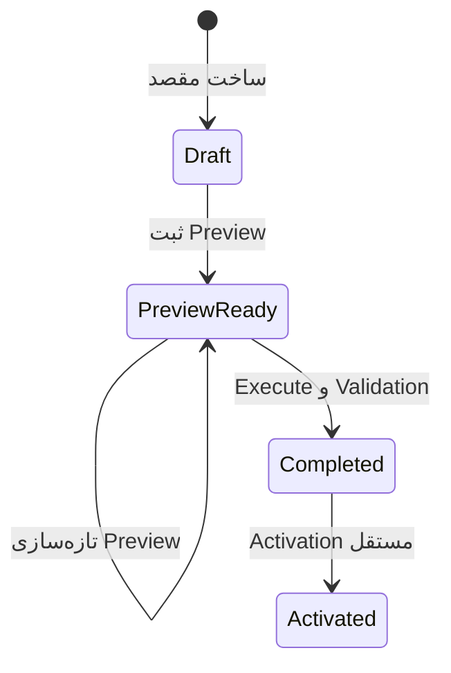

# PMCS — Controlled Project Bootstrap API v1

- شناسه قرارداد: `PMCS-API-PRJ-BOOTSTRAP-001`
- API version: `v1`
- Contributor catalog: `pmcs.project-bootstrap/v1.0.0`
- مالک: `projects.core`
- وضعیت: `V1.1-PRJ1 Candidate`

## ۱. هدف و مرز

این API قابلیت «ساخت از روی پروژهٔ موجود» را به‌صورت `ProjectBootstrapPlan` اجرا می‌کند؛ Clone مستقیم Database نیست. مقصد در نخستین Command با شناسه، کد، نام، تاریخ‌ها و اطلاعات یکتای مستقل ساخته می‌شود و تا پایان Validation در وضعیت `Draft` باقی می‌ماند. فعال‌سازی Command جداگانه است.

هیچ endpoint این قرارداد در Offline قابل اجرا نیست. رابط می‌تواند انتخاب‌های ناتمام را به‌صورت Draft محلی نگه دارد، اما Create، Preview، Execute و Activate همگی به اتصال، Actor معتبر و ارزیابی تازه Permission نیاز دارند.

## ۲. مسیرها

| Method | Path | Permission | اثر |
| --- | --- | --- | --- |
| `POST` | `/api/v1/project-bootstraps` | `projects.bootstrap.create` + `projects.bootstrap.preview` روی مبدأ | ساخت مقصد Draft، Plan و Preview اولیه |
| `GET` | `/api/v1/project-bootstraps/{planId}` | `projects.bootstrap.preview` روی مبدأ و مقصد | خواندن آخرین Preview ثبت‌شده |
| `POST` | `/api/v1/project-bootstraps/{planId}/preview` | `projects.bootstrap.preview` روی مبدأ و مقصد | تازه‌سازی Snapshot و Digest با `BaseRevision` |
| `POST` | `/api/v1/project-bootstraps/{planId}/execute` | `projects.bootstrap.create`؛ و برای اعضا `projects.bootstrap.members_copy` روی مبدأ/مقصد | اجرای همان Digest تأییدشده |
| `GET` | `/api/v1/project-bootstraps/{planId}/result` | `projects.bootstrap.preview` روی مبدأ و مقصد | نتیجهٔ JSON قابل دانلود |
| `POST` | `/api/v1/project-bootstraps/{planId}/activate` | `projects.bootstrap.activate` روی مقصد | Gate آمادگی و Activation مستقل |

تمام Mutationها `Idempotency-Key` می‌خواهند. Tenant و Actor از Context احراز هویت می‌آیند و Body حق تعیین آن‌ها را ندارد. Plan، مبدأ و مقصد همیشه با Tenant جاری Query می‌شوند؛ بنابراین شناسهٔ پروژه Tenant دیگر به‌صورت ضمنی قابل استفاده نیست.

## ۳. State machine



Preview منقضی، Plan دارای Revision متفاوت یا Digest تغییرکرده Execute نمی‌شود. Refresh پس از `Completed` یا `Activated` مجاز نیست.

## ۴. دسته‌های انتخابی و Contributorها

| Category | Contributor | دادهٔ Allowlisted |
| --- | --- | --- |
| `BaseSettings` | `projects.base-settings` | Contract model تنظیماتی، Planning mode و Capability enablement سازگار |
| `Calendar` | `projects.calendar` | Calendar mode و Working-days mask؛ Time zone مستقل مقصد حفظ می‌شود |
| `Locations` | `projects.locations` | Location فعال با Code/Name/Hierarchy و شناسه‌های جدید؛ ROOT مقصد حفظ می‌شود |
| `RoleTemplates` | `projects.role-templates` | فقط Override پروژه‌ای؛ کاتالوگ مشترک Reference می‌شود |
| `WorkflowTemplates` | `projects.workflow-templates` | Daily-report workflow و Cutoff default |
| `FormTemplates` | `projects.form-templates` | فقط Override صریحاً Cloneable |
| `ReportTemplates` | `projects.report-templates` | Reporting-frequency default؛ نه Run/Output |
| `Lookups` | `projects.lookups` | فقط Lookup اعلام‌شده به‌عنوان Cloneable |
| `Members` | `identity.project-memberships` | Reference حساب موجود، Role و `Project` scope انتخابی |
| `NotificationDefaults` | `projects.notification-defaults` | فقط Default جدید مقصد؛ نه Notification موجود |
| `GroupDefaults` | `projects.group-defaults` | فقط Default جدید مقصد؛ نه Group/Message history |

Contributorهایی که Override پروژه‌ای موجود ندارند نتیجهٔ صریح `Skipped` می‌دهند؛ این وضعیت به‌معنی کپی پنهان یا ادعای موفقیت ساختگی نیست. Capability با حالت `Active` مبدأ در مقصد به `SetupRequired` و حالت `Suspended` به `NotEnabled` تبدیل می‌شود تا مقصد بدون شواهد Setup عملیاتی نشود.

## ۵. Preview و Digest

هر Preview شامل موارد زیر است:

- Source/Target identity و Revision؛
- Location Snapshot مبدأ و مقصد؛
- دسته‌ها و Member selection مرتب‌شده؛
- Contributor ID/schema و catalog version؛
- Membership snapshot token شامل وضعیت مؤثر Account/Membership؛
- ردیف‌های `Added`، `Skipped`، `Conflict` و `Blocked` همراه دلیل؛
- `AlwaysExcluded` denylist؛
- SHA-256 digest و زمان انقضا.

Execute Project state را دوباره می‌سازد و Digest را با Plan و درخواست مقایسه می‌کند. Identity contributor نیز Snapshot خود را پیش از Mutation دوباره اعتبارسنجی می‌کند. اگر Identity transaction موفق و Projects transaction موقتاً ناموفق شود، Retry همان Plan نتیجه Identity را از Receipt داخلی بازیابی می‌کند و Membership تکراری نمی‌سازد.

## ۶. Member boundary

- User account، Credential، Profile یا Avatar کپی نمی‌شود؛
- Membership مقصد با `ProjectMembership.Assign` و User ID موجود ساخته می‌شود؛
- Account غیرفعال یا Membership تعلیق‌شده/منقضی `Skipped` است؛
- Role یا Scope پشتیبانی‌نشده، Membership مفقود و Permission نامعتبر `Blocked` است؛
- Membership متفاوت موجود در مقصد `Conflict` است؛
- اعلان عضویت فقط در Execute تأییدشده و در همان Identity transaction ثبت می‌شود؛
- Preview اجازه ضمنی مقصد ایجاد نمی‌کند.

## ۷. Conflict policy

| Policy | رفتار |
| --- | --- |
| `FailOnConflict` | وجود هر `Conflict` اجرای Plan را متوقف می‌کند |
| `SkipConflicts` | ردیف متعارض بازنویسی نمی‌شود و سایر ردیف‌های امن ادامه می‌یابند |

وجود `Blocked` در هر دو Policy مانع اجراست. Silent escalation یا overwrite مجاز نیست.

## ۸. Denylist دائمی

این مسیر به هیچ Contributor عملیاتی متصل نیست و موارد زیر را کپی نمی‌کند:

- شناسه، کد، نام، تاریخ‌ها، قراردادهای ثبت‌شده و مقادیر یکتای مبدأ؛
- Daily Report، Progress actual، Project State و Snapshot؛
- Finance، Payment، Voucher، Budget actual و Transaction/Contract/Procurement history؛
- Message، File، Attachment، Technical document، RFI، Approval، Issue، Action و Notification history؛
- Agent conversation، Audit، Outbox، Idempotency، Offline queue و Sync state.

## ۹. Result، Audit و Event

نتیجه شامل همان Digest، تمام ردیف‌ها، Summary چهارحالته، مقصد نهایی Draft و Validationهای `destination-draft`، `preview-execute-digest`، `operational-data-excluded`، `membership-reference-only` و `location-count` است.

Execute یک Audit با نوع `ProjectBootstrapCompleted` و Event نسخه‌دار زیر را در تراکنش Projects می‌نویسد:

```text
projects.bootstrap.completed.v1
```

Payload Event فقط schema version، Plan/Source/Target IDs، Digest، زمان UTC و Correlation ID را دارد.

## ۱۰. کدهای اصلی خطا

| Code | Status | معنی |
| --- | --- | --- |
| `project.bootstrap.not_found` | `404` | Plan در Tenant جاری وجود ندارد |
| `project.bootstrap.revision.conflict` | `409` | Plan پس از بارگذاری تغییر کرده است |
| `project.bootstrap.preview.changed` | `409` | Snapshot/Digest تغییر کرده و Preview تازه لازم است |
| `project.bootstrap.preview.expired` | `409` | زمان Preview پایان یافته است |
| `project.bootstrap.conflicts` | `409` | Policy توقف و حداقل یک Conflict وجود دارد |
| `project.bootstrap.blocked` | `422` | حداقل یک ردیف Blocked است |
| `project.bootstrap.members.changed` | `409` | Snapshot عضویت تغییر کرده است |
| `project.bootstrap.members.permission_denied` | `403` | Permission انتقال عضو معتبر نیست |
| `project.bootstrap.target.not_draft` | `409` | مقصد دیگر Draft نیست |
| `project.activate.readiness_failed` | `422` | Activation مستقل از Gate آمادگی عبور نکرد |

